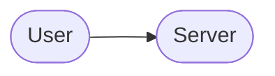
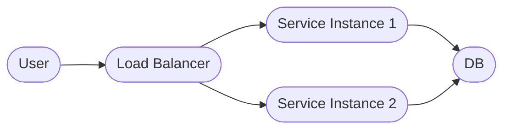
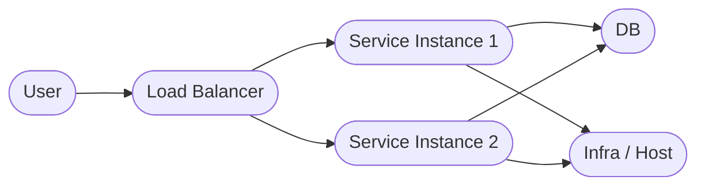

# Introduction to Modern Observability

What observability means and why it matters today

---
layout: default
heading: A Simple System
---

---
layout: default
heading: It Gets More Complex
---

---
layout: default
heading: Even More Complex
---

---
layout: statement
---

Observability is the ability to **measure a system's current state** based on the data it generates, recorded as logs, metrics, and traces
